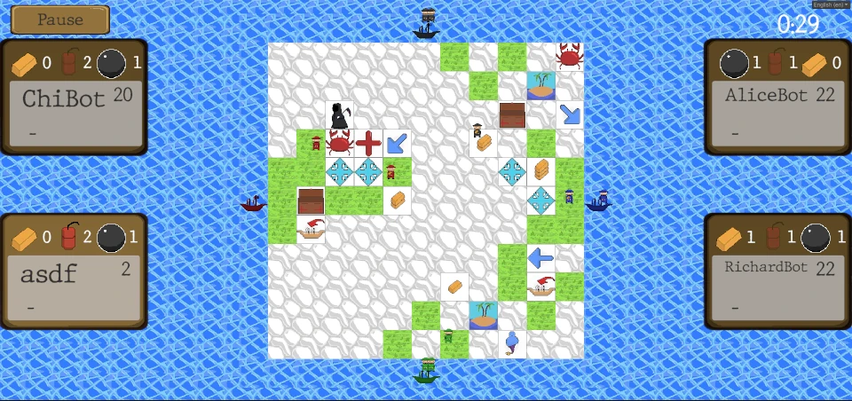
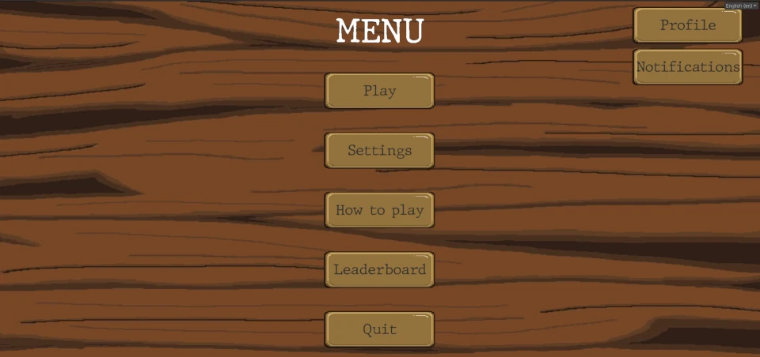
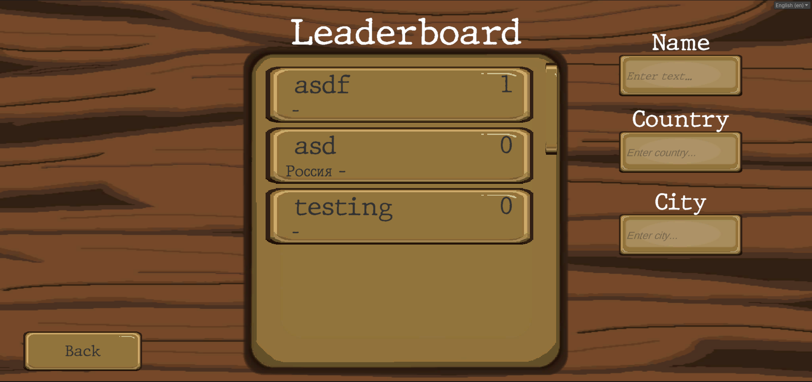
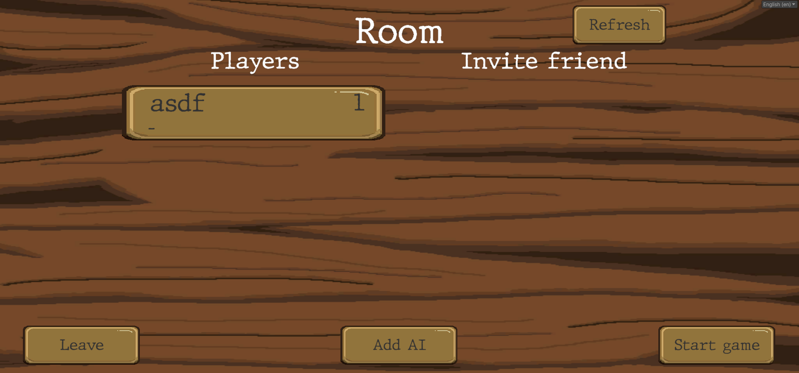
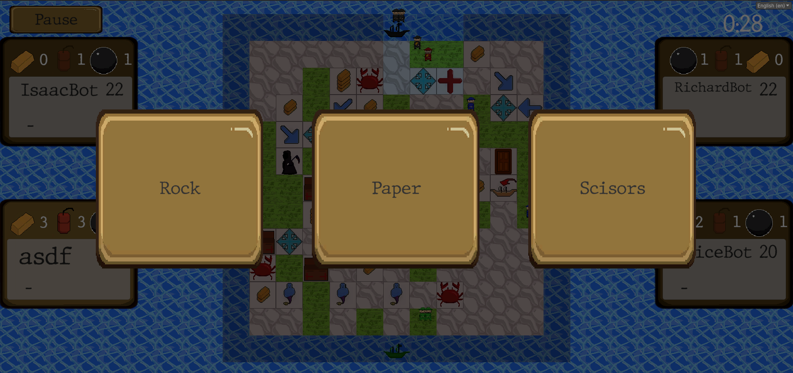
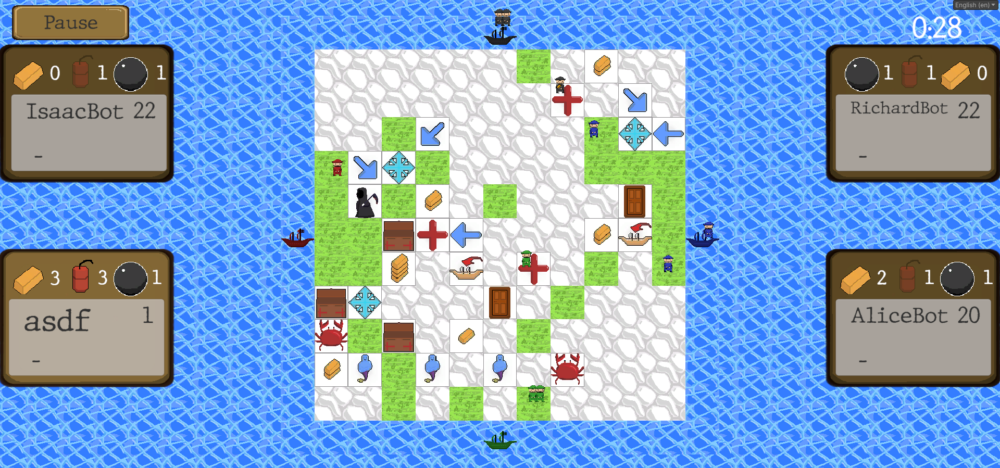

# Pirates Game

A multiplayer Unity game with custom server on C#.

## Features

Game synchronization

Random board generation

Matchmaking

Custom login system

Custom leaderboards

Localization

AI system

Friend system

Room creation

## Additional info

Unity version - 2022.3.12f1

Uses [NetCoreServer](https://github.com/chronoxor/NetCoreServer) for tcp/websocket connection.

## What I would do differently today

This project is a few years old. Here's what I would do differently, if I developed this project today.

Data serialization. Serialization is done using JSON. And for deserialization a single enum is used. 
This created some maintanance issues. Today I would use protobuf for this game.

Client and server in one project. In this project I created client in Unity and server in plain C#. 
This gave me freedom to use modern C# features on server, and made server binary quite small. 
However this added unnesasery complexity. And server and client had to be maintained seperately. 
Have I done this project today, I would put client and server in one project and used conditional compilation.

Use external database. For this project I've used sqlite to store user data. 
While the project was simple and sqlite is fast enough. If I did this project today I would use external databse like Postgresql.

## Media

## Copyright

Shield: [![CC BY-NC 4.0][cc-by-nc-shield]][cc-by-nc]

This work is licensed under a
[Creative Commons Attribution-NonCommercial 4.0 International License][cc-by-nc].

[![CC BY-NC 4.0][cc-by-nc-image]][cc-by-nc]

[cc-by-nc]: https://creativecommons.org/licenses/by-nc/4.0/
[cc-by-nc-image]: https://licensebuttons.net/l/by-nc/4.0/88x31.png
[cc-by-nc-shield]: https://img.shields.io/badge/License-CC%20BY--NC%204.0-lightgrey.svg
